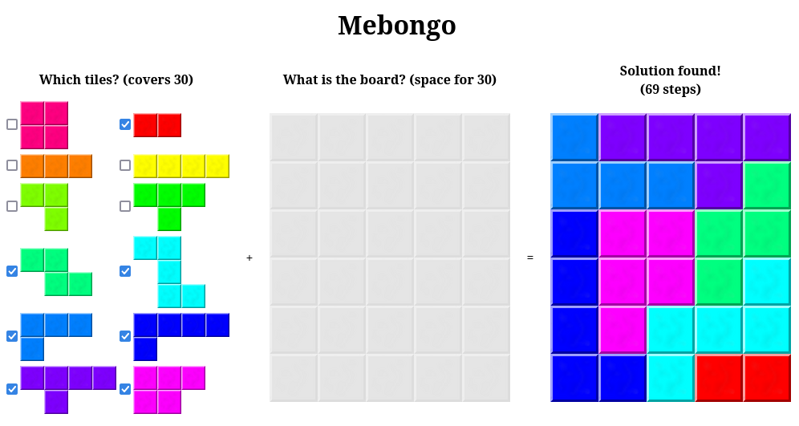
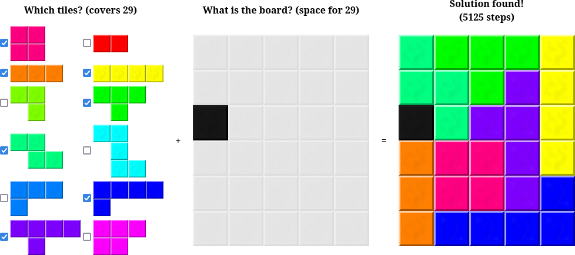

# [mebongo](https://benwiederhake.github.io/mebongo/)

Solver for polynominoes-like games, including for example [Ubongo](https://boardgamegeek.com/boardgame/16986/ubongo).

The [mebongo website](https://benwiederhake.github.io/mebongo/) quickly and easily tells you the solution to your polynominoes puzzle:

## Table of Contents

- [Building](#building)
- [Performance](#performance)
- [TODOs](#todos)
- [NOTDOs](#notdos)
- [Contribute](#contribute)

## Building

1. Install [rust and cargo](https://rustup.rs/)
2. Install wasm-pack (`cargo install wasm-pack`)
3. Build the `.wasm` file and bindings: `wasm-pack build --target web`
4. Optional: `wasm-opt pkg/mebongo_bg.wasm -O3 -o pages/foo.wasm` (saves 4 bytes, su much wow)
5. Optional: `uglifyjs mebongo.js -o mebongo.js` to minify the generated bindings
6. Move the files to the `gh-pages` branch and either upload to github or try it locally (e.g. `python3 -m http.server`)

That's it. There are no external JS or CSS runtime dependencies during runtime.

Note that there are a lot of tests, to make sure everything is consistent (`cargo test`, plus a quick config sanity-check during page load).

## Performance

"Easy" and "hard" puzzles from the Ubongo game are usually solved instantly, taking less than 100 DFS steps, usually far below 50.
This means that performance does not really matter too much.

The maximum number of steps is hardcoded in the JavaScript code as
`const MAX_STEPS = 10000;`. This seems to be equivalent to about 50ms on my computer.
I expect that this is a good upper bound with mobile devices in mind.

I couldn't find any input that would exceed this:

So I'll leave the limit at 10k, and I don't really think more performance would help
anything. If you're reading this, pease consider making the website more responsive (for mobile screen sizes) instead.

There are multiple places that can easily be sped up:
- It's too easy to accidentally drag a page element (thereby not clicking it), or miss the label of the tile checkboxes. This gives the *impression* that the page is too slow to register an input. This should be fixed.
- I'm pretty sure that the tail of `search::State::closed` can be dropped at the indicated time in `State::step_single`, but I didn't think about it too hard yet.
- The tile and tile-layout orders imply search preferences. Does this need any tweaking?
- If the dead cell detection proves that there is zero slack (i.e. number of cells covered by tiles plus dead cells equals to the number of cells on the board), then we could try to see if there are any cells that can only be covered by a single tile. Currently it doesn't "understand" this scenario, so this might be causing the trouble.

## TODOs

Next up are these:
* Make the webpage prettier
* Make the webpage work better (or at all?) on mobile browsers
* Check whether using the website is faster than playing it in person (I doubt it)

## NOTDOs

Here are some things this project will definitely *not* support:
* Try to be the best polynominoes solver. I'm sure there are better ones, but this one is special, because this one is mine.
* Generate levels or let you play in the browser. That would require so much work on the UI that it should be easier to start from scratch.

## Contribute

Feel free to dive in! [Open an issue](https://github.com/BenWiederhake/mebongo/issues/new) or submit PRs.
